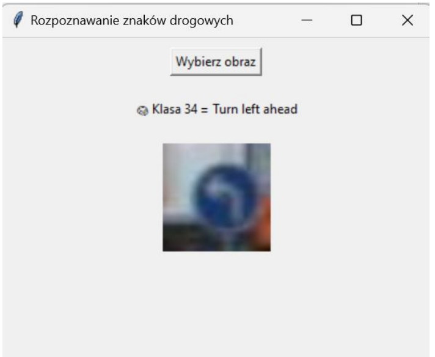

# Traffic Sign Classification & Deployment

## Project Overview
This project focuses on the development and deployment of a **Convolutional Neural Network (CNN)** for traffic sign recognition. Using Python and TensorFlow, I built a model capable of classifying traffic signs with high accuracy, which was then integrated into a standalone desktop application.

## Technical Implementation
### The Model
* **Architecture:** 3 Convolutional layers (Conv2D) with Max Pooling and Dropout for regularization.
* **Optimization:** Adam optimizer with Categorical Crossentropy.
* **Input:** Images resized to 30x30 pixels, normalized for better performance.
* **Dataset:** Based on the German Traffic Sign Recognition Benchmark (GTSRB).

### Technologies Used
* **Languages:** Python
* **Deep Learning:** TensorFlow, Keras
* **Libraries:** NumPy, Pandas, Matplotlib, OpenCV, Scikit-learn
* **Deployment:** Standalone Windows Executable (.exe)

## Application Showcase
To demonstrate the practical use of the trained model, I developed a standalone desktop application. The app allows users to upload images and receive real-time classification results.

### Features:
* **User-Friendly Interface:** Simple GUI for easy interaction.
* **Real-time Prediction:** Instant processing of traffic sign images using the CNN model.
* **Standalone Execution:** Built as an executable (.exe) for Windows.

### Interface Preview

## How to Run
1. Clone the repository: `git clone https://github.com/AdamOl3/Traffic-signs-classification.git`
2. Install dependencies: `pip install -r requirements.txt`
3. Launch the notebook in `src/` to see the training process or run the application to test the model.

